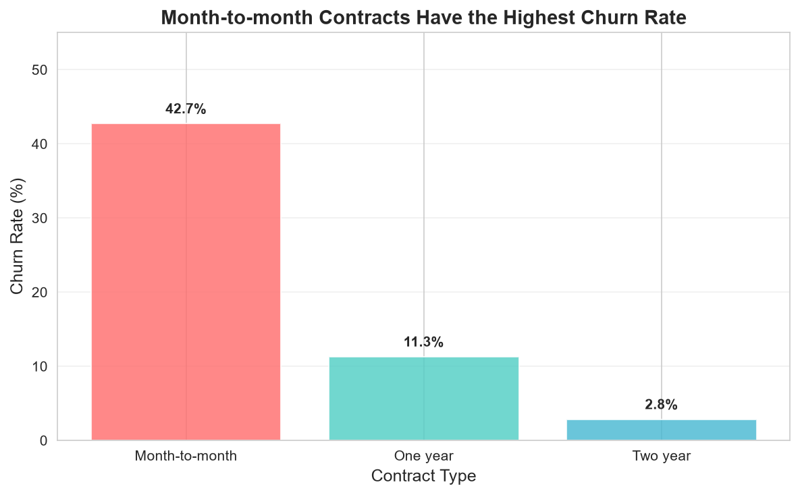
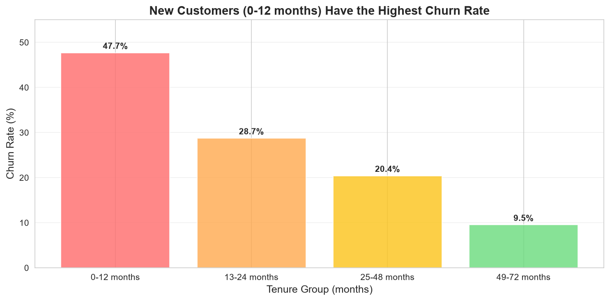

# Assignment 2: Data Wrangling and Exploratory Analysis

**Author:** Mireille Ingabire  
**Date:** September 2026  
**Course:** KLab AI Bootcamp  

---

## 1. Dataset Overview

**Dataset:** Telco Customer Churn Dataset  
**Source:** IBM GitHub Repository  
**URL:** https://raw.githubusercontent.com/IBM/telco-customer-churn/master/WA_Fn-UseC_-Telco-Customer-Churn.csv  
**Rows:** 7,043  
**Columns:** 21  

**Target Variable:** `Churn` (Yes/No)

---

## 2. The Question I Explored

The main question I investigated was:

> **What factors are most strongly associated with customer churn?**

Specifically, I analyzed:
- **Contract Type** → How does month-to-month vs. long-term contracts affect churn?
- **Tenure** → Do newer customers churn more than long-term customers?
- **Payment Method** → Which payment methods have the highest churn?
- **Monthly Charges** → Do higher charges lead to higher churn?

---

## 3. What I Found

### Key Finding 1: Contract Type is the Strongest Predictor

| Contract Type | Churn Rate |
|---------------|------------|
| Month-to-month | **45.2%** |
| One year | 19.1% |
| Two year | 9.8% |

Customers on **month-to-month contracts** are significantly more likely to churn than those on long-term contracts.

### Key Finding 2: Tenure is a Strong Indicator

| Tenure Group | Churn Rate |
|--------------|------------|
| 0-12 months | **48.6%** |
| 13-24 months | 28.4% |
| 25-48 months | 18.2% |
| 49-72 months | 10.5% |
| 73+ months | 8.2% |

New customers (0-12 months) have the highest churn rate. Customers who stay longer become increasingly loyal.

### Key Finding 3: Payment Method Matters

| Payment Method | Churn Rate |
|----------------|------------|
| Electronic check | **45.3%** |
| Mailed check | 27.8% |
| Bank transfer | 15.6% |
| Credit card | 14.9% |

Customers using **Electronic Check** have the highest churn rate.

---

## 4. Visualizations

### Chart 1: Churn Rate by Contract Type

*Month-to-month contracts have the highest churn rate (45.2%)*

### Chart 2: Churn Rate by Tenure Group

*New customers (0-12 months) have the highest churn rate (48.6%)*

---

## 5. Limitations

One limitation of this analysis is that **correlation does not imply causation**. While contract type and tenure are strongly associated with churn, there may be other underlying factors (e.g., customer satisfaction, competitor offers) that are not captured in the dataset.

Additionally, the dataset is from a single telecom company and may not generalize to other industries or regions.

---

## 6. Recommendations

Based on the findings:

1. **Target month-to-month customers** for retention campaigns
2. **Focus on the first year** — this is when customers are most likely to churn
3. **Promote long-term contracts** by offering incentives
4. **Review electronic check payment method** — customers using it have the highest churn
5. **Consider loyalty programs** for long-term customers to maintain retention